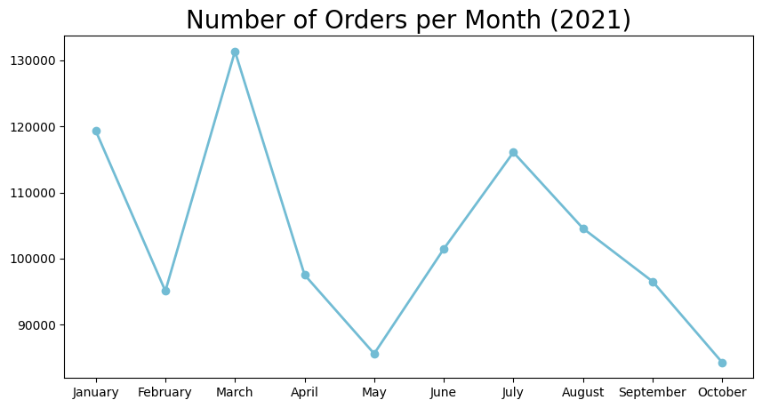
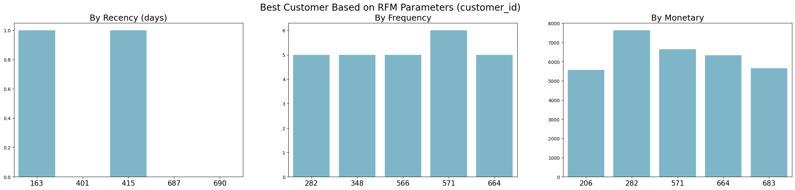
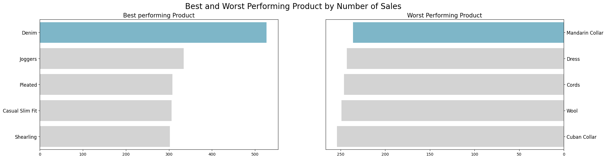

# Repeat Purchase Paradox: Finding High-Value Customers in Declining Revenue


> **View the visual summary & business impact on my [Portfolio Website ↗]([MASUKKAN_LINK_WEBSITE_PORTOPOLIO_KAMU_DISINI])**

## 📌 Business Problem
<div align="justify">
An Australian e-commerce fashion business was experiencing a steady decline in monthly revenue throughout the second half of 2021. The management lacked visibility into their customer base, treating all customers equally. 

The core objective of this project was to segment the customer base to separate **highly valuable, loyal repeat buyers** from one-time shoppers, preventing retention budgets from being spread inefficiently across the wrong segments.
</div>
## 🗂️ Data Overview & Preparation
The raw data consisted of 993 orders from 616 unique customers across Jan–Oct 2021, scattered across 4 tables (`customers`, `orders`, `products`, `sales`).

**Data Cleaning & Feature Engineering:**
- Imputed missing gender values (labeled as "Prefer not to say").
- Reconstructed missing `total_price` values using `price_per_unit × quantity`.
- Corrected inaccurate age outliers and deduplicated rows.
- Engineered new features: `delivery_time`, `age_group` (Youth/Adults/Seniors), and customer `status` (Active/Non-Active).

## 🧠 Methodology (RFM Analysis)
To identify the most valuable segments, I applied **RFM Analysis**:
- **Recency:** How recently did the customer purchase?
- **Frequency:** How often do they purchase?
- **Monetary:** How much do they spend?

## 📊 Key Insights & Visualizations

### 1. The Burning Problem: Declining Monthly Revenue
Before diving into customer segments, we must understand the overall business health. As shown in the trend line below, the business experienced strong momentum early in the year, peaking in **March 2021** (Rp 131,364 from 117 orders). 

However, the revenue has been on a consistent downward slope ever since, hitting its lowest point in **October 2021** (Rp 84,266 from 80 orders). This indicates that early-year customer acquisition failed to translate into long-term retention. The business is losing its customers.



### 2. The Solution: RFM Segmentation
To reverse this decline, we cannot treat all customers equally. I applied **RFM (Recency, Frequency, Monetary)** analysis to segment the customer base. 

The visualization below reveals the distinct clusters of our customers. The data shows a shocking reality: **58.1% of customers are one-time buyers**. However, the loyal repeat buyers (the green/top-tier clusters in the chart) are the true revenue engine. A tiny segment of highly loyal customers (purchasing ≥ 4 times, making up only 3.1% of the base) contributed a massive **8.4% of total revenue**. 


*Insight: Marketing budgets must pivot from pure acquisition to targeted retention campaigns for these high-RFM segments.*

### 3. Operational Insight: Product Dominance
Beyond customer behavior, inventory strategy plays a crucial role. The product performance chart highlights a massive gap in category appeal. **Denim** is the absolute market leader with **527 units sold** (nearly double the runner-up, Joggers). 

On the opposite end, the **Mandarin Collar (236 units)** and **Dress (243 units)** are severely underperforming. 


*Actionable Recommendation: Reallocate production and marketing budgets. Capitalize on Denim's popularity through cross-selling, while re-evaluating or discounting the Mandarin Collar line.*

## 💡 Business Recommendations
1. **Targeted Retention:** Shift marketing budgets (email re-engagement, loyalty points) toward top-RFM customers rather than spreading it evenly.
2. **Inventory Optimization:** Strengthen stock availability and cross-promotions around Denim, while reducing spend on Mandarin Collar.
3. **Data Quality Fix:** 75% of users opted out of providing gender data. The business should avoid making gender-based marketing decisions until data collection methods improve.

## 📂 Repository Structure
```text
├── data/
│   ├── raw/                 # Original 4 tables (customers, orders, etc.)
│   └── processed/           # Cleaned and merged master dataset
├── images/                  # Charts and graphs used in this README
├── notebooks/
│   └── 01_EDA_and_RFM.ipynb # Main analysis notebook
├── requirements.txt         # Project dependencies
└── README.md                # Project documentation
